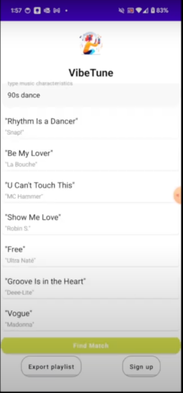

# VibeTune

This proof-of-concept Android app uses the ChatGPT API to generate a list of ten songs based on user input, with direct YouTube links for each song.

- Creates a ChatGPT API request from user input, handled by Retrofit and OkHttp.
- Parses recommendations and manages errors with logging and retry mechanisms.
- Updates the UI with results via StateFlow for responsive performance.



## Features

- **Input Selection**: Choose preferences to guide music recommendations.
- **Related Song Input**: Enter a song to find similar tracks.
- **Recommendations**: Receive a curated list of ten songs.
- **YouTube Links**: Access songs via YouTube links.
- **Easy Navigation**: Simple, intuitive interface for exploring music.

## Getting Started

### Prerequisites

- **Android Studio** Arctic Fox or later.
- **Android SDK** version 21 or higher.
- **Kotlin** version 1.6.10 or later.

### Installation

1. **Clone the Repository**
   ```bash
   git clone git@github.com:hamid42643/VibeTune.git
